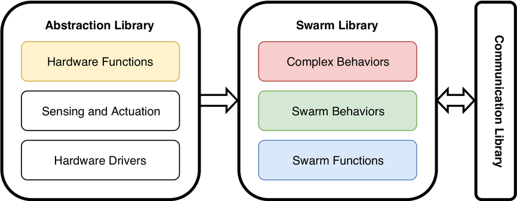

# Swarm Functions Library

The swarm functions library provides simple functionalities that enable swarm algorithms to work. It is part of the swarm library.

## Getting Started
The behavior library is based on the latest ROS long-term support release [ROS Kinetic Kame](https://wiki.ros.org/kinetic/). Newer versions may also work.

To run swarm functions of this library, the abstraction library is required. The abstraction library consists of three sub-libraries:
* [hardware functions](https://github.com/cpswarm/hardware_functions)
* [sensing and actuation](https://github.com/cpswarm/sensing_actuation)
* hardware drivers

The communication between CPSs is based on the [CPSwarm Communication Library](https://github.com/cpswarm/swarmio).

Furthermore, the [cpswarm_msgs](https://github.com/cpswarm/cpswarm_msgs/) are required by most packages in this library.

For detailed usage instructions, please refer to the individual ROS packages in this repository.

## Contributing
Contributions are welcome. 

Please fork, make your changes, and submit a pull request. For major changes, please open an issue first and discuss it with the other authors.

## Affiliation

This work is supported by the European Commission through the [CPSwarm H2020 project](https://cpswarm.eu) under grant no. 731946.
