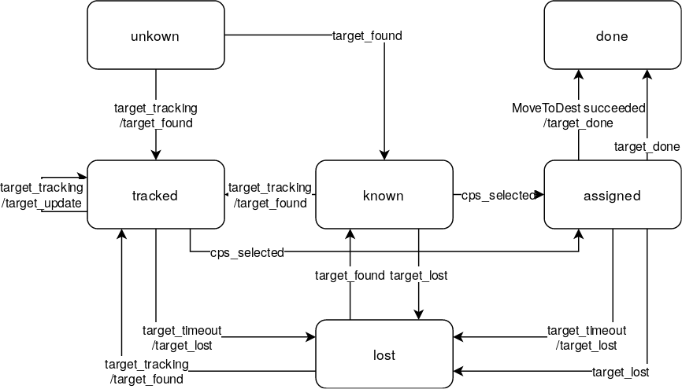

# target_monitor

This package manages information about targets in a swarm of cyber physical systems (CPSs).

## Dependencies
This package depends on the following message definitions:
* [geometry_msgs](https://wiki.ros.org/geometry_msgs)
* [cpswarm_msgs](https://cpswarm.github.io/cpswarm_msgs/html/index-msg.html)

The communication between CPSs is based on the [CPSwarm Communication Library](https://github.com/cpswarm/swarmio).

The following packages of the [swarm functions](https://github.com/cpswarm/swarm_functions) library are required:
* task_allocation

The following packages of the [sensing and actuation](https://github.com/cpswarm/sensing_actuation) library are required:
* *_pos_provider

Further required packages are:
* [tf2](https://wiki.ros.org/tf2/)

## Execution
Run the launch file
```
roslaunch target_monitor target_monitor.launch
```
to launch the `target_monitor` node.

### Launch File Parameters
The launch file can be configured with following parameters:
* `id` (integer, default: 1)
  The identifier (ID) of the CPS used for name spacing in simulation.
* `output` (string, default: screen)
  Whether to show the program output (`screen`) or to write it to a log file (`log`).

### Parameter Files
In the `param` subdirectory there are two parameter files `target_monitor.yaml` and `targets.yaml` that allows to configure the behavior of the `target_monitor` node. The `target_monitor.yaml` contains the following parameters:
* `~loop_rate` (real, default: 1.5)
  The frequency in Hz at which to run the control loops.
* `~queue_size` (integer, default: 10)
  The size of the message queue used for publishing and subscribing to topics.
* `~tracking_timeout` (real, default: 5.0)
  The time in seconds after which a target transitions into the state lost when no target information is received.
* `~target_tolerance` (real, default: 0.1)
  The path of the smach state machine whose state shall be exchanged.
* `~fov` (real, default: 0.5)
  Range of the target tracking camera in meter. It is used to simulate target detection. Targets within this distance are detected by the CPS.
* `~simulation` (boolean, default: false)
  Whether the targets are detected virtually by position or actually by the camera tracking topic.

The `targets.yaml` contains the coordinates of the simulated targets. It is only used when the parameter `simulation` is set to `true`. They are given as two list parameters where the list index is the ID of the target:
* `~targets_x` (real list, default: [])
   The x-coordinates of the simulated targets.
* `~targets_y` (real list, default: [])
   The y-coordinates of the simulated targets.

## Nodes

### target_monitor
The `target_monitor` node keeps track of targets and their positions that are being detected by CPSs in the swarm. They are typically detected by a camera. Each target has a unique numeric ID assigned to it which should be a positive integer. Targets that are detected locally by this CPS are reported through the `target_tracking` topic. It contains the offset between the current position and the target position in form of a transform. This information can either originate from another node or, if `simulation` is set to `true`, from this node. In the latter case, the target detection is triggered according to the current position of the CPS and the coordinates given in the `targets.yaml` parameter file. Targets that are being managed have a certain state associated to them. This is depicted by the following diagram where the transitions are labled with incoming event / outgoing event:



The state of the target changes depending on local and remote events that are exchanged between CPSs through the [CPSwarm Communication Library](https://github.com/cpswarm/swarmio).


#### Subscribed Topics
* `pos_provider/pose` ([geometry_msgs/PoseStamped](https://docs.ros.org/api/geometry_msgs/html/msg/PoseStamped.html))
  The current position of this CPS.
* `target_tracking` ([cpswarm_msgs/TargetTracking](https://cpswarm.github.io/cpswarm_msgs/html/msg/TargetTracking.html))
  The offset of the target as reported by the camera.
* `cps_selected` ([cpswarm_msgs/TaskAllocatedEvent](https://cpswarm.github.io/cpswarm_msgs/html/msg/TaskAllocatedEvent.html))
  The event of a target being assigned by this CPS.
* `target_done` ([cpswarm_msgs/TargetPositionEvent](https://cpswarm.github.io/cpswarm_msgs/html/msg/TargetPositionEvent.html))
  The event of a target being completed by this CPS.
* `bridge/events/target_found` ([cpswarm_msgs/TargetPositionEvent](https://cpswarm.github.io/cpswarm_msgs/html/msg/TargetPositionEvent.html))
  The event of a target being found by another CPS. Messages are exchanged between CPSs using the [CPSwarm Communication Library](https://github.com/cpswarm/swarmio).
* `bridge/events/target_update` ([cpswarm_msgs/TargetPositionEvent](https://cpswarm.github.io/cpswarm_msgs/html/msg/TargetPositionEvent.html))
  Target updates from other CPSs. Messages are exchanged between CPSs using the [CPSwarm Communication Library](https://github.com/cpswarm/swarmio).
* `bridge/events/cps_selected` ([cpswarm_msgs/TaskAllocatedEvent](https://cpswarm.github.io/cpswarm_msgs/html/msg/TaskAllocatedEvent.html))
  The event of a target being assigned by another CPS. Messages are exchanged between CPSs using the [CPSwarm Communication Library](https://github.com/cpswarm/swarmio).
* `bridge/events/target_lost` ([cpswarm_msgs/TargetPositionEvent](https://cpswarm.github.io/cpswarm_msgs/html/msg/TargetPositionEvent.html))
  The event of a target being lost by another CPS. Messages are exchanged between CPSs using the [CPSwarm Communication Library](https://github.com/cpswarm/swarmio).
* `bridge/events/target_done` ([cpswarm_msgs/TargetPositionEvent](https://cpswarm.github.io/cpswarm_msgs/html/msg/TargetPositionEvent.html))
  The event of a target being completed by another CPS. Messages are exchanged between CPSs using the [CPSwarm Communication Library](https://github.com/cpswarm/swarmio).
* `bridge/uuid` ([cpswarm_msgs/TargetPositionEvent](https://cpswarm.github.io/cpswarm_msgs/html/msg/TargetPositionEvent.html))
  The UUID of this CPS.

#### Published Topics
* `target_tracking` ([cpswarm_msgs/TargetTracking](https://cpswarm.github.io/cpswarm_msgs/html/msg/TargetTracking.html))
  The offset of the target that is simulated by this node. Messages are published if `simulation` is set to `true` and the distance between the CPS and a simulated target is less than or equal to `fov`.
* `target_found` ([cpswarm_msgs/TargetPositionEvent](https://cpswarm.github.io/cpswarm_msgs/html/msg/TargetPositionEvent.html))
  The event of a target being found by this CPS. The event is forwarded by the [CPSwarm Communication Library](https://github.com/cpswarm/swarmio) to the other swarm members.
* `target_update` ([cpswarm_msgs/TargetPositionEvent](https://cpswarm.github.io/cpswarm_msgs/html/msg/TargetPositionEvent.html))
  Target updates from this CPS. The event is forwarded by the [CPSwarm Communication Library](https://github.com/cpswarm/swarmio) to the other swarm members.
* `target_lost` ([cpswarm_msgs/TargetPositionEvent](https://cpswarm.github.io/cpswarm_msgs/html/msg/TargetPositionEvent.html))
  The event of a target being lost by this CPS. The event is forwarded by the [CPSwarm Communication Library](https://github.com/cpswarm/swarmio) to the other swarm members.
* `target_done` ([cpswarm_msgs/TargetPositionEvent](https://cpswarm.github.io/cpswarm_msgs/html/msg/TargetPositionEvent.html))
  The event of a target being completed by this CPS. The event is forwarded by the [CPSwarm Communication Library](https://github.com/cpswarm/swarmio) to the other swarm members.

#### Action Servers
* `cmd/target_done` ([cpswarm_msgs/TargetAction](https://cpswarm.github.io/cpswarm_msgs/html/action/Target.html))
  Sets the state of a target to done. This invokes the target_done event to be published.

## Code API
[target_monitor package code API documentation](https://cpswarm.github.io/swarm_functions/target_monitor/docs/html/files.html)
